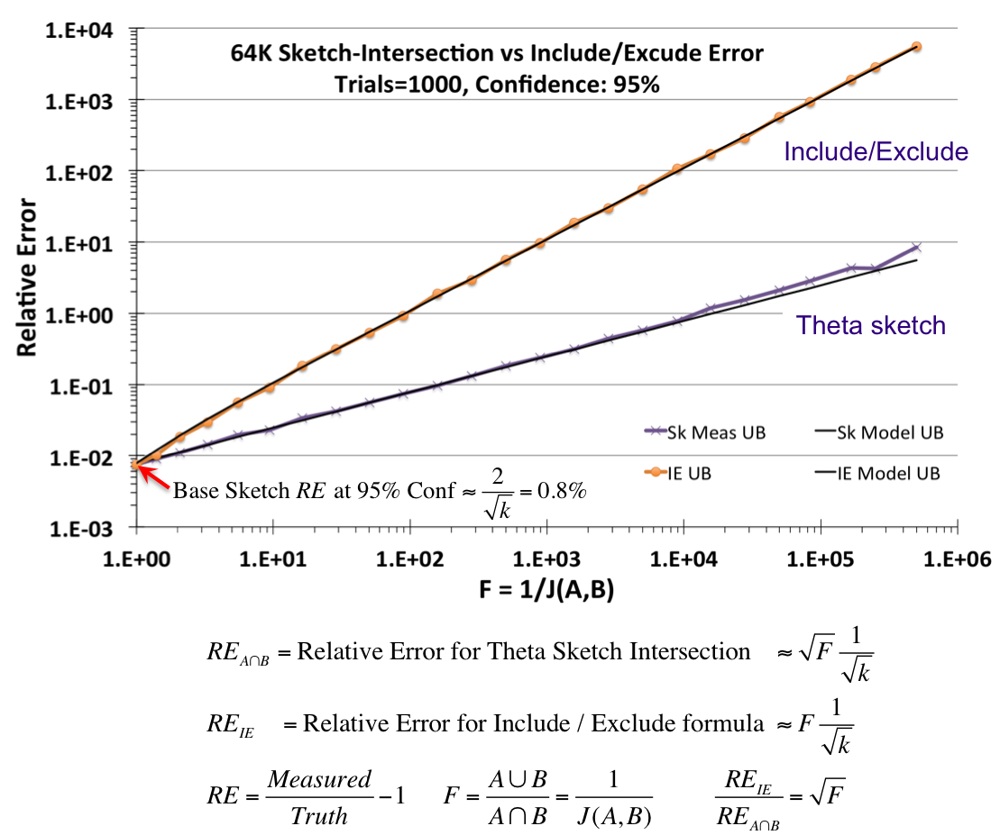

# aggonydb
Aggony DB is a one-trick-pony database that can perform rapid aggregation of
many-fields low-cardinality data

## ...but what is it tho?

Say you have spreadsheet-like data:

| key | name                    | age | city     | ..1000's of columns |
|-----|-------------------------|-----|----------|---------------------|
| 1   | caleb                   | 40  | Brisbane | ...                 |
| 2   | gina                    | 40  | Brisbane |                     |
| 3   | mike                    | 30  | London   |                     |
| 4   | gina                    | 30  | London   |                     |
| ... | ...another million rows | ... | ...      |                     |

Then you want to analyze it, specifically with *filtering + aggregation*. For example
you want to answer the following questions:

- _How many people called `gina` are in `London`?_
- _How many people called `caleb` are `30`?_

In essence, you're applying filters to the data and counting how
many records match.

This repo provides a proof-of-concept implementation of an HTTP
api for:
- storing data into a Postgresql database
- querying that database for filtered aggregations

See the Demo further down.

## This is what DBs are good at. What's the problem?

It turns out that using conventional techniques like storing all
the data in a relational database becomes slow when the size of
the data increases. The speed issue is not easily solved
with indexes. Because _any_ field can participate in a filter
operation, one would have to create an index for every field,
and the problem of combinatorial explosion still remains because
the database engine still needs to perform large costly joins
on all the filtered fields to arrive at the _intersection_.

This repo doesn't invent anything—all it does is wrap an HTTP
api around the [Apache DataSketches](https://datasketches.apache.org/)
library.
[They describe the filtering problem](https://datasketches.apache.org/docs/Background/TheChallenge.html)
in much more detail.

## Ok so what are you proposing?

Ha, I'm not proposing anything, this repo is an experiment to play
around with using probabilistic data structures to see whether
they provide an acceptable solution to the filtering-aggregation
problem described above.

The Apache DataSketches project provides efficient implementations
of several "sketches", which are the probabilistic data structures
used for these cardinality (unique counting) approximations. 

The specific one used in this demo project is the
[Theta Sketch](https://datasketches.apache.org/docs/Theta/ThetaSketchFramework.html).
Another sketch called _HyperLogLog_ (HLL) got pretty popular a few years ago
and is also a cardinality estimator. HLL has low estimate error for
counts and unions, but estimates of _intersection_ have much larger
error bounds because HLL doesn't natively support an intersection
set operation―you have to calculate it manually with the 
[inclusion-exclusion principle](https://en.wikipedia.org/wiki/Inclusion%E2%80%93exclusion_principle)
which can result in a large estimate error if one of the sets has
a much smaller cardinality than the others.  This scenario will
be common in our "filter a spreadsheet" example.

Instead, we use the Theta Sketch. There are several benefits of the 
Theta Sketch over HLL, but the primary reason is that cardinality
estimate for set intersections can be several orders of magnitude
lower. The following graph, from [this page](https://datasketches.apache.org/docs/Theta/ThetaAccuracyPlots.html), shows how the 
relative error for the inclusion-exclusion method grows, compared
to the Theta Sketch native implementation, as the similarity of the
two sets being intersected decreases (the intersection gets smaller
and smaller towards the right).



These are my reasons for using the Theta Sketch:
- intersection is natively implemented, much smaller relative error
- other set operations, like `AnotB` are also natively implemented
- unlike HLL, can combine sketches of different accuracy: quoting from the
  [Accuracy](https://datasketches.apache.org/docs/Theta/AccuracyOfDifferentKUnions.html) page: _One of the benefits of the Theta
  Sketch algorithms is that they support the union of sketches that have
  been created with different values of k or Nominal Entries_
- the implementation in datasketches gives error bounds on estimates
- the error bounds are unbiased above/below (HLL errors are biased) 
- just like HLLs, unions introduce no new error regardless of how many
  are unioned together


## Demo

First step is to run the docker container to start the Postgresql DB.
You need a checkout of https://github.com/apache/datasketches-postgresql
alongside a checkout of this repo.  Then, in the folder for this repo:

```shell
$ docker-compose up -d
```

Then, start the HTTP server:

```shell
$ cargo run
```

Then, let's add some data (using [httpie](https://httpie.io/) :

```shell
$ http post localhost:8080/add/demo \
    fields[name]=gina \
    fields[age]:=40 \
    fields[height]:=1.7 \
    fields[adult]:=true \
    fields[stars]:=5.0 \
    domain_key:=1
ok

$ http post localhost:8080/add/demo \
    fields[name]=gina \
    fields[age]:=40 \
    fields[height]:=1.7 \
    fields[adult]:=true \
    fields[stars]:=5.0 \
    domain_key:=2
ok

$ http post localhost:8080/add/demo \
    fields[name]=gina \
    fields[age]:=40 \
    fields[height]:=1.7 \
    fields[adult]:=true \
    fields[stars]:=5.0 \
    domain_key:=3
ok

```

Notes:
- The "demo" dataset name (in the URL, `/add/{dataset}`) is created on the
  fly.
- The given field names and values also do not need to exist, they're created
  on the fly.
- The `domain_key` is the disambiguator. The three additions made above mean
  3 separate events. If you're seeing this data from another database, it
  might make sense to use the primary key, for example, depending on what
  you're adding.
- Note that all JSON types are allowed in the request POST body. (Internally,
  they're all saved as string values but that doesn't affect anything)

Now let's do a count:

```shell
$ http post localhost:8080/filter/demo items:='[{"field_name": "name", "value": "gina"}]'

{
    "estimate": 3.0,
    "lower_bound": 3.0,
    "upper_bound": 3.0
}

```

Notes:
- The request POST body must have an `items` field, which is an array of
  objects. Each object must have a `field_name` attribute and a `value`
  attribute. This sequence defines the intersection of these fields and values
  over all the submitted data.
- The `estimate` result field is the cardinality estimate of the intersection
  (in this case we only have one filter).
- The `lower_bound` and `upper_bound` fields define the accuracy range, and
  will be greatly appreciated by consumers of the estimates.

## TODO:

- [ ] more examples in README showing multiple filters
- [ ] more test cases for empty sets
- [ ] make tests actually runnable in github ci (will have to run the PG container)
- [ ] make a "batch" endpoint for receiving larger chunks of data
- [ ] make an endpoint for receiving serialized theta sketches. The Python
  datasketches library can produce serialized theta sketches that are byte
  compatible with what is stored here.
- [ ] contemplate an additional API that can save sketches alongside a date
  field. It could be very useful for producing trends.
- [ ] contemplate extracting a domain_key out of the supplied `add` fields,
  rather than requiring it to be specified separately. Perhaps the name of
  the field can be specified separately.  Not sure how I feel about this,
  more magic probably helps nobody in the long run.
- [ ] investigate doing more sketch stuff in rust space rather than in DB. More
  of a scaling thing.
- [ ] investigate using postgres partitions for easily "ageing out" old sketches.
  I read a blog about something like this but I can't remember where that was
  right now.
- [ ] Add links and reading material to this README.